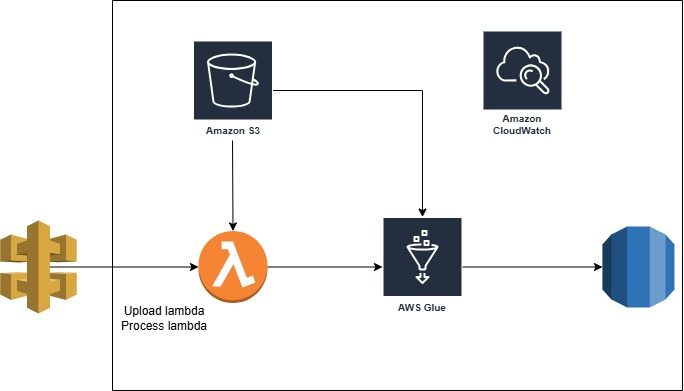

# EMIS_Assessment

## Data pipeline to process patients records into dashboards

### The Task
An external system / supplier is sending patient data to our platform using the FHIR standard. Our analytics teams find this format difficult to work with when creating dashboards and visualizations. You are required to tranform these FHIR messages into a more workable format preferably in a tabular format. Include any documentation / commentary you deem necessary.

### Approach

We can have a data pipeline where we have three endpoint:
- Get S3 presigned URL API: 
    - This API will be used to get the AWS S3 pre-signed url to upload the json files.
- Upload files API:
    - This API will be used to upload json files into AWS S3. It is an endpoint provided as a response from above URL.
- Init Process API:
    - This API will invoke AWS Glue Pyspark script to process and store the record in AWS RDS (MySQL)
 
### Architecture Diagram

